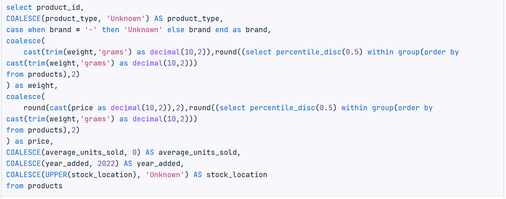
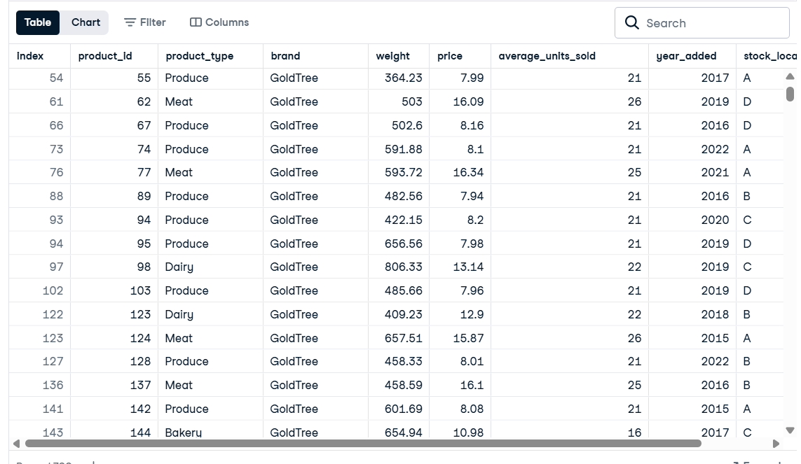
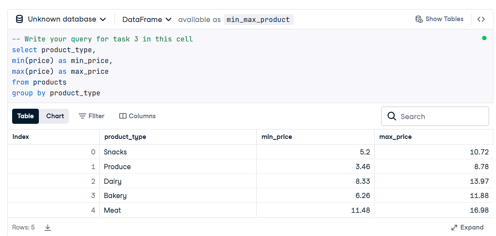
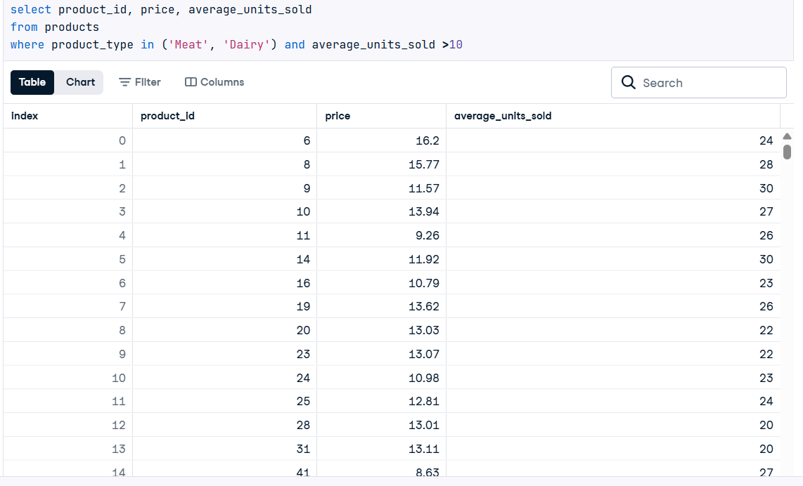

#  Grocery Store Sales

FoodYum is a grocery store chain that is based in the United States.

Food Yum sells items such as produce, meat, dairy, baked goods, snacks, and other household food staples.

As food costs rise, FoodYum wants to make sure it keeps stocking products in all categories that cover a range of prices to ensure they have stock for a broad range of customers. 

## Data

The data is available in the table `products`.

The dataset contains records of customers for their last full year of the loyalty program.

| Column Name | Criteria                                                |
|-------------|---------------------------------------------------------|
|product_id | Nominal. The unique identifier of the product.  Missing values are not possible due to the database structure.|
| product_type | Nominal. The product category type of the product, one of 5 values (Produce, Meat, Dairy, Bakery, Snacks).  Missing values should be replaced with “Unknown”. |
| brand | Nominal. The brand of the product. One of 7 possible values.  Missing values should be replaced with “Unknown”. |
| weight | Continuous. The weight of the product in grams. This can be any positive value, rounded to 2 decimal places.  Missing values should be replaced with the overall median weight. |
| price | Continuous. The price the product is sold at, in US dollars. This can be any positive value, rounded to 2 decimal places.  Missing values should be replaced with the overall median price. |
| average_units_sold | Discrete. The average number of units sold each month. This can be any positive integer value.  Missing values should be replaced with 0. |
| year_added | Nominal. The year the product was first added to FoodYum stock. Missing values should be replaced with 2022. |
| stock_location | Nominal. The location that stock originates. This can be one of four warehouse locations, A, B, C or D  Missing values should be replaced with “Unknown”. |

# 1.Determine how many products have the `year_added` value missing.

Last year (2022) there was a bug in the product system. For some products that were added in that year, the `year_added` value was not set in the data. As the year the product was added may have an impact on the price of the product, this is important information to have. 

# 2.Update datatype in criteria  

| Column Name | Criteria                                                |
|-------------|---------------------------------------------------------|
|product_id | Nominal. The unique identifier of the product.  Missing values are not possible due to the database structure.|
| product_type | Nominal. The product category type of the product, one of 5 values (Produce, Meat, Dairy, Bakery, Snacks).  Missing values should be replaced with “Unknown”. |
| brand | Nominal. The brand of the product. One of 7 possible values.  Missing values should be replaced with “Unknown”. |
| weight | Continuous. The weight of the product in grams. This can be any positive value, rounded to 2 decimal places.  Missing values should be replaced with the overall median weight. |
| price | Continuous. The price the product is sold at, in US dollars. This can be any positive value, rounded to 2 decimal places.  Missing values should be replaced with the overall median price. |
| average_units_sold | Discrete. The average number of units sold each month. This can be any positive integer value.  Missing values should be replaced with 0. |
| year_added | Nominal. The year the product was first added to FoodYum stock. Missing values should be replaced with last year (2022). |
| stock_location | Nominal. The location that stock originates. This can be one of four warehouse locations, A, B, C or D  Missing values should be replaced with “Unknown”. |

# 3.Determine the minimum and maximum values for each product type.

# 4.Detail at meat and dairy products where the average units sold was greater than ten.

